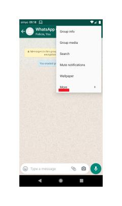
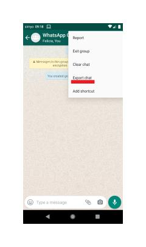

# Android Mac Instructie
In deze instructie laten we zien hoe u uw WhatsApp-data kunt downloaden op een telefoon met het Android-besturingssysteem en hoe daarna de Mijn Voetsporen applicatie een geanonimiseerde samenvatting maakt van de chats, tot slot wordt deze laatst genoemde data via de mail aan ons gedoneerd.

Wanneer u onderstaande stappen volgt, heeft u uw WhatsApp-data voor verschillende groepen op uw pc zodat u die daarna kan transformeren en inleveren.

### 1. Open WhatsApp op uw telefoon

### 2. Kies de groepen waarvan u uw data wilt opvragen

 - Voor dit onderzoek willen we u vragen **de vijf WhatsApp-chatgroepen te kiezen waarin u het meeste over nieuws praat.** Dit mogen groepschats zijn, maar ook chats met één andere persoon.

### 3. Selecteer één van de chats waarvan u de data wilt opvragen

### 4. Selecteer Menu → ‘More’ → ‘Export chat’ (zie onderstaande afbeeldingen)

### 5. Selecteer ‘ZONDER MEDIA’

### 6. Selecteer Gmail als verzendmethode

- U kunt zelf kiezen via welk kanaal u uw WhatsApp-data naar uzelf wenst te transporteren. In deze instructie kiezen wij ervoor de data via **gmail** te verzenden. U kunt desgewenst ook gebruikmaken van **Bluetooth**, **Google Drive,** of een andere methode. In de vervolgstappen gaan we ervan uit dat u Gmail selecteert. (**Let op!** U verzend de data bij deze stap nog niet naar de onderzoekers).

### 7. Plaats uw persoonlijke mailadres in het adresveld

- Uw WhatsApp-data wordt automatisch als bijlage bij de mail verzonden.

### 8. Op uw Mac: open de mail en download de WhatsApp-data

- Als het goed is, is de mail met uw WhatsApp-data naar uw persoonlijke mail verzonden. Dit kan, afhankelijk van de snelheid van uw internetverbinding, enige tijd in beslag nemen. U download de WhatsApp-data door de bijlage in de mail te downloaden die eindigt op ‘.txt’. Grote kans dat het een zip-bestand is. Dit maakt niks uit, ook dit bestand kan worden gebruikt.  

### 9. Herhaal stap 4 t/m 9 voor de andere vier chats waarvan u de data wilt opvragen

### 10. U heeft nu uw WhatsApp-data gedownload!

U heeft nu 5 tekstbestanden gedownload op uw computer. 

### 11. De volgende stap is om de Mijn Voetsporen applicatie te downloaden

Mijn Voetsporen applicatie transformeert de chats in een geanonimiseerde samenvatting. 

Download de applicatie voor Windows [hier](https://github.com/FeLoe/Lab2020/blob/standalone/standalone/dist/mijnvoetsporen.dmg?raw=True) 

### 12. Mijn Voetsporen applicatie downloaden voor Mac

- Tip: Als je probeert de app te openen zie je misschien dit:

In dit geval moet je control (CTRL) + klikken of met twee vingers klikken om naar de menu te komen en op 'Open' klikken.
  

### 13. Het uploaden van de 5 WhatsApp bestanden.
Vervolgens kunt u de 5 bestanden uploaden in de Mijn Voetsporen applicatie. U kunt alle bestanden in één keer selecteren om ze te uploaden naar de applicatie. 

### 14. Het mailen van de geanonimiseerde bestanden
U krijgt nu een bestand met de naam 'foot_print data', bestaande uit twee CSV bestanden. Het kan zijn dat dit al in het bestaande bestand staat, maar het kan ook buiten het originele WhatsApp bestand staan. Check dit goed!

Kies alleen het bestand "processed_whatsapp_final". Het bestand "processed_whatsapp_final" is volledig geanonimiseerd (u kunt dit checken) en is op geen enkele manier terug te leiden naar uw persoonlijke gegevens. 

Mail dit bestand (LET OP juiste bestand dus) naar j.vander.erve@student.vu.nl

Ga terug naar de [survey](https://vuamsterdam.eu.qualtrics.com/jfe/form/SV_b3BpjjteY6l24Kx) zodat u de laatste vraag kan beantwoorden. 

