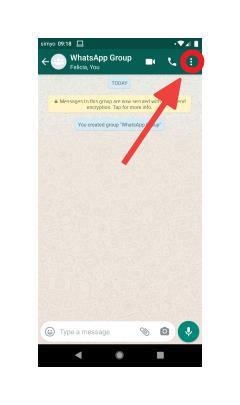
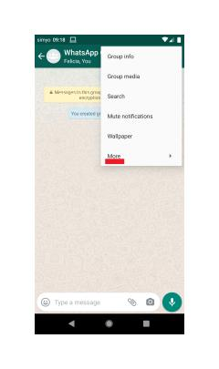
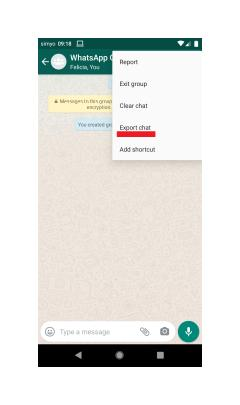
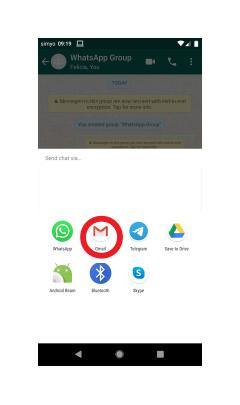

# Android Instructie
In deze instructie laten we zien hoe u uw WhatsApp-data kunt downloaden op een telefoon met het Android-besturingssysteem. Wanneer u onderstaande stappen volgt, heeft u uw WhatsApp-data voor verschillende groepen op uw pc.

### 1. Open WhatsApp op uw telefoon.

### 2. Kies de groepen waarvan u uw data wilt opvragen.

 - Voor dit onderzoek willen we u vragen **de vijf WhatsApp-chatgroepen 
   te kiezen waarin u het meeste over nieuws praat.** Dit mogen   
   groepschats zijn, maar ook chats met één andere persoon.

### 3. Selecteer één van de chats waarvan u de data wilt opvragen.

### 4. Selecteer Menu → ‘More’ → ‘Export chat’ (zie onderstaande afbeeldingen)

### 5. Selecteer ‘WITHOUT MEDIA’

### 6. Selecteer Gmail als verzendmethode

- U kunt zelf kiezen via welk kanaal u uw WhatsApp-data naar uzelf wenst te transporteren. In deze instructie kiezen wij ervoor de data via **gmail** te verzenden. U kunt desgewenst ook gebruikmaken van **Bluetooth**, **Google Drive,** of een andere methode. In de vervolgstappen gaan we ervan uit dat u Gmail selecteert. (**Let op!** U verzend de data bij deze stap nog niet naar de onderzoekers).

### 7. Plaats uw persoonlijke mailadres in het adresveld

- Uw WhatsApp-data wordt automatisch als bijlage bij de mail verzonden.

### 8. Op uw laptop/PC: open de mail en download de WhatsApp-data

- Als het goed is, is de mail met uw WhatsApp-data naar uw persoonlijke mail verzonden. Dit kan, afhankelijk van de snelheid van uw internetverbinding, enige tijd in beslag nemen. U download de WhatsApp-data door de bijlage in de mail te downloaden die eindigt op ‘.txt’.

### 9. Herhaal stap 4 t/m 9 voor de andere vier chats waarvan u de data wilt opvragen.

### 10. U heeft nu uw WhatsApp-data gedownload!
