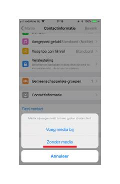

# iOS Windows Instructie
In deze instructie laten we zien hoe u uw WhatsApp-data kunt downloaden op een telefoon met het iOS-besturingssysteem. Wanneer u onderstaande stappen volgt, heeft u uw WhatsApp-data voor verschillende groepen op uw pc.

### 1. Open WhatsApp op uw telefoon.

### 2. Kies de groepen waarvan u uw data wilt opvragen.

 - Voor dit onderzoek willen we u vragen **de vijf WhatsApp-chatgroepen te kiezen waarin u het meeste over nieuws praat.** Dit mogen groepschats zijn, maar ook chats met één andere persoon.

### 3. Selecteer één van de chats waarvan u de data wilt opvragen.

### 4. Selecteer de chat → ‘Media, links en docs’ → ‘Links’ 

### 5. Selecteer ‘exporteer chat’ -> E-mail -> 'Zonder media' (zie onderstaande afbeeldingen)

- U kunt zelf kiezen via welk kanaal u uw WhatsApp-data naar uw PC/laptop wenst te transporteren. In deze instructie kiezen wij ervoor de data via **E-mail** te verzenden. U kunt desgewenst ook gebruikmaken van **Bluetooth**, of een andere methode. In de vervolgstappen gaan we ervan uit dat u E-mail selecteert. (**Let op!** U verzend de data bij deze stap nog niet naar de onderzoekers).

### 6. Plaats uw persoonlijke mailadres in het adresveld

- Uw WhatsApp-data wordt automatisch als bijlage bij de mail verzonden.

### 7. Op uw laptop/PC: open de mail en download de WhatsApp-data

- Als het goed is, is de mail met uw WhatsApp-data naar uw persoonlijke mail verzonden. Dit kan, afhankelijk van de snelheid van uw internetverbinding, enige tijd in beslag nemen. U download de WhatsApp-data door de bijlage in de mail te downloaden die eindigt op ‘.txt’.

### 8. Herhaal stap 4 t/m 9 voor de andere vier chats waarvan u de data wilt opvragen.

### 9. U heeft nu uw WhatsApp-data gedownload!

U heeft nu 5 tekstbestanden gedownload op uw computer. 

### 11. De volgende stap is om de Mijn Voetsporen applicatie te downloaden

Mijn Voetsporen applicatie transformeert de chats in een geanonimiseerde samenvatting. 

Download de applicatie voor Windows [hier](https://github.com/FeLoe/Lab2020/blob/standalone/standalone/dist/mijnvoetsporen-windows-multiplefiles.zip?raw=true) 

### 12. Mijn Voetsporen applicatie downloaden voor Windows

Vervolgens klik je op 'download' (zie de eerste afbeelding). Het bestand dat wordt gedownload is een zip-bestand. Deze dient te worden uitgepakt en ergens op je computer te worden opgeslagen (hoe het uitgepakte bestand en het zip bestand (met rits) eruit zien zie je in de tweede afbeelding). Het uitgepakte bestand wordt vervolgens geopend en daarin staat Mijn Voetsporen deze kan worden geopend (zie de laatste afbeelding). 

Meldingen van eventuele virusscanners kunt u negeren. Het programma is veilig en kan zonder risico's worden uitgevoerd. Mocht u een virusscanner tegenkomen klik dan zoals te zien is op de vierde afbeelding op 'toch uitvoeren'. Als je de Norton Virusscanner hebt klik dan op 'herstellen' zoals te zien is in de 5e afbeelding. Hierna kunt u in het uitgepakte bestand de Mijn Voetsporen app zonder problemen openenen. Als u een andere virusscanner heeft bel mij dan gelijk: 0624920355. 

### 13. Het uploaden van de 5 WhatsApp bestanden.
Vervolgens kunt u de 5 bestanden uploaden in de Mijn Voetsporen applicatie. U kunt alle bestanden in één keer selecteren om ze te uploaden naar de applicatie. 

### 14. Het mailen van de geanonimiseerde bestanden
U krijgt nu een bestand met de naam 'foot_print data', bestaande uit twee CSV bestanden. Het kan zijn dat dit al in het bestaande bestand staat, maar het kan ook buiten het originele WhatsApp bestand staan. Check dit goed!

Kies alleen het bestand "processed_whatsapp_final". Het bestand "processed_whatsapp_final" is volledig geanonimiseerd (u kunt dit checken) en is op geen enkele manier terug te leiden naar uw persoonlijke gegevens. 

Mail dit bestand (LET OP juiste bestand dus) naar j.vander.erve@student.vu.nl

Ga terug naar de [survey](https://vuamsterdam.eu.qualtrics.com/jfe/form/SV_b3BpjjteY6l24Kx) zodat u de laatste vraag kan beantwoorden. 

